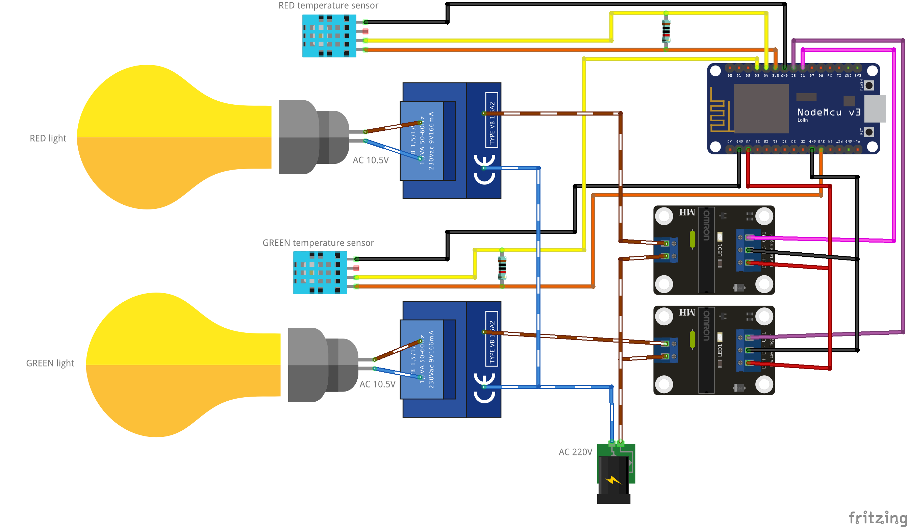

# traffic-light-controller

<a href="https://raw.githubusercontent.com/skhg/traffic-light-controller/master/images/market.jpeg"></a>

The [_Ampelmännchen_](https://en.wikipedia.org/wiki/Ampelm%C3%A4nnchen) are a popular symbol from East Germany, which display on the pedestrian traffic lights at every street corner. There's even a Berlin-based [retail chain](https://www.ampelmann.de/) that's inspired by their design.

I came across a set of secondhand Ampelmann signals at a flea market, and I wanted to control them from my phone. If you'd like to do the same, read on!

## Overview

**Health Warning:** This project uses 220V mains power. I am not an electrician. Follow these instructions at your own risk.

I wanted to build something with a _Berlin aesthetic_, and would be fun for visitors to my home to interact with. Unfortunately our visitor numbers [declined severely this year](https://en.wikipedia.org/wiki/COVID-19_pandemic), but still hoping for a great reaction in 2021...?

<p align="center"><a href="https://www.youtube.com/watch?v=a89mtLCUfTs"></a><br/>
 <i>Controlling the traffic lights from the webapp on iOS</i></p>

How does it work?
 1. The webapp runs in your browser
 1. It connects to a web server on the Arduino microcontroller
 1. The Arduino controls the lights using relays, which are [electronically-operated switches](https://en.wikipedia.org/wiki/Relay).
 1. When the lights change their state, the webapp will stay in sync
 1. ???
 1. Profit!

I used solid-state relays, which can be a bit more expensive than an [optocoupler relay](https://www.amazon.de/-/en/gp/product/B078Q326KT/ref=ppx_yo_dt_b_search_asin_title?ie=UTF8&psc=1) but don't make any [noise](https://youtu.be/FhQLq-eqfEc?t=2) as they switch, which is preferable for this project. To run the system we need a WiFi-capable, Arduino compatible microcontroller board - so the trusty [ESP8266 NodeMCU](https://en.wikipedia.org/wiki/NodeMCU) works perfectly here. 220V AC (mains) power is required anyway so there is no need for batteries or any low-power considerations.

The Arduino acts as a web application server (kind-of, see below), and also as an API server to control the lights themselves. Since we can have multiple users controlling the lights at once, each client subscribes to a WebSocket event stream, to get updates on the lights' status, without polling. More on this below too.

Since we have the option to run the lights in "party mode" where they pulse to a a rhythm, the Arduino code also needs to run some time-based logic that can't block anything else the board is doing. This isn't too difficult, and there are some useful [resources](https://forum.arduino.cc/index.php?topic=503368.0) online which explain how to "[do multiple things at once](https://forum.arduino.cc/index.php?topic=223286.0)" with arduino.

## Prerequisite knowledge
For anyone following this article i'm assuming a basic knowlegde of:
 * Electronics assembly techniques (soldering, wiring)
 * Microcontroller projects (Arduino)
 * Web technologies (HTTP and WebSockets)

## Materials Required

For assembly:
 * 1 set of Ampelmann traffic lights
 * Assorted small [M2](https://www.amazon.de/-/en/gp/product/B07SGP8TWS/ref=ppx_yo_dt_b_search_asin_title?ie=UTF8&psc=1), [M3, M4](https://www.amazon.de/-/en/gp/product/B00B22VHPC/ref=ppx_yo_dt_b_asin_title_o00_s00?ie=UTF8&psc=1) nuts and bolts
 * A little [wooden board](https://www.amazon.de/-/en/gp/product/B07D76MKFY/ref=ppx_yo_dt_b_search_asin_title?ie=UTF8&psc=1) - for mounting our controller securely
 * Double-sided sticky tape - for mounting the temperature sensors
 
Electronic components:
 * 1 [NodeMCU v3 ESP8266](https://www.amazon.de/-/en/gp/product/B074Q2WM1Y/ref=ppx_yo_dt_b_search_asin_title?ie=UTF8&psc=1) - The microcontroller board
 * 1 Multiple Channel [Solid-State Relay](https://www.amazon.de/-/en/gp/product/B07DK6P9CV/ref=ppx_yo_dt_b_asin_title_o00_s00?ie=UTF8&psc=1) - the electronic switch which controls the lightbulbs
 * 2x [DHT11](https://www.amazon.de/-/en/gp/product/B07Q3H24LL/ref=ppx_yo_dt_b_search_asin_title?ie=UTF8&psc=1) - Temperature/humidity sensors
 * A [220V power cable](https://www.amazon.de/-/en/gp/product/B07NSSHP9S/ref=ppx_yo_dt_b_search_asin_title?ie=UTF8&psc=1) - Should capable of taking a few amps, you may also need to cut this apart for interior wiring
 * 2 10kΩ [resistors](https://www.amazon.de/-/en/gp/product/B07Q87JZ9G/ref=ppx_yo_dt_b_search_asin_title?ie=UTF8&psc=1) - Required to operate the DHT11 sensors
 * [Perfboard](https://www.amazon.de/-/en/gp/product/B07BDKG68Q/ref=ppx_yo_dt_b_search_asin_title?ie=UTF8&psc=1) - To solder everything together on
 * [Ribbon Cable](https://www.amazon.de/-/en/gp/product/B076CLY8NH/ref=ppx_yo_dt_b_search_asin_title?ie=UTF8&psc=1) - To connect to components off the main board, such as the temperature sensors and relay.
 * [JST Headers](https://www.amazon.de/YIXISI-Connector-JST-XH-Female-Adapter/dp/B082ZLYRRN/ref=sr_1_1_sspa?dchild=1&keywords=jst+kit&qid=1605108398&sr=8-1-spons&psc=1&spLa=ZW5jcnlwdGVkUXVhbGlmaWVyPUFITU9OODc2TFg4MzEmZW5jcnlwdGVkSWQ9QTAxNTU4NzMyOVdJRFVETUhCV1Y3JmVuY3J5cHRlZEFkSWQ9QTAwODA5ODVQWFZCU00yNTJBSlYmd2lkZ2V0TmFtZT1zcF9hdGYmYWN0aW9uPWNsaWNrUmVkaXJlY3QmZG9Ob3RMb2dDbGljaz10cnVl) - Plugs which will terminate the cable connections.
 * A generic USB power supply
 * A power strip
 
Other necessary basic tools:
 * Soldering iron
 * Pliers
 * Screwdriver
 * Wire stripper
 * Power drill

## Circuit diagram<a name="circuit"></a>

Here's how the circuit looks in a block diagram showing all components laid out flat.




And here's how the circuit board and temperature sensor board are wired on the perfboard. Depending on how you mount this inside the case, and what size perfboard is used, you may have more space to play around with.


<i>(Exported from Fritzing [file](traffic-light-board.fzz))</i>

## Construction

The traffic light comes with 2 steel mounts, which are hollow. At the front, it has two doors which open to reveal the bulbs, reflectors and the transformers behind. These traffic bulbs are designed to run on 10.5V (30VA) as is printed on the transformer label. Behind the reflector, there's actually a lot of empty space. In a normal traffic light installation, all the control logic would be handled by an external box, but we want to have everything self-contained. So we will make the most of the space available.


The ESP8266 and the relay board are mounted onto a small wooden board, that itself is bolted to the back of the traffic light case.

The live and neutral wires coming from the 220V mains need to be split. Neutral connects to each of the transformers, as before. Live connects to two of the relays. Each of the relays then needs to be connected to neutral on both of the transformers. This completes the circuit, and when the relay is in it's "on" state, the light will come on.


The two temperature sensors are mounted on to identical mini-perfboards. They are attached to the upper edge of each reflector section with double-sided sticky tape, and connected to the main board with ribbon cable.


Once everything is hooked up, we can test it out, and close it up.

<p align="center"><br/>
<i>Testing the bulbs with the solid-state relay</i></p>

## Software

There are a few moving parts in the software here, so i've split this into a couple of sections.

### Overview

The software is intended to allow users on the same LAN to control the traffic light through a browser, without any prior authorisation needed. Security is not considered for this project. The browser shows the state of the system in real time.

<p align="center"></p>

Each device on your local network has it's own [private](https://en.wikipedia.org/wiki/Private_network) IP address (e.g. `192.168.1.20`). Some routers such as the FritzBox also let you browse by local hostnames, so that `192.168.1.20` is also accessible at `mydevice.fritz.box`. For the traffic light, the device hostname is `traffic-light` so we can visit it at `http://traffic-light.fritz.box`.

### Webapp architecture & performance

The webapp is a very simple responsive single-page application. It shows:
* Red on/off
* Green on/off
* Party mode on/off
* Temperature of the red and green enclosures
* Currently playing song information.

Code is under the [/webapp](/webapp) directory. No external dependencies are required since it's just relying on standard browser features, like [CSS transform](https://developer.mozilla.org/en-US/docs/Web/CSS/transform), [WebSockets](https://developer.mozilla.org/en-US/docs/Web/API/WebSocket), and [XHR](https://developer.mozilla.org/en-US/docs/Web/API/XMLHttpRequest/Using_XMLHttpRequest). You can preview the running application [here](http://jackhiggins.ie/traffic-light-controller/) although it won't control anything, since of course you're not on my LAN. If you visited it from the local network, at e.g. `http://traffic-light.fritz.box` it would work fully.


Upon loading the page, the application makes a GET request to find the current status at `/api/status`, and then opens a WebSocket connection to the server on port `81`. Subsequent status updates will always come via the WebSocket, in order to keep multiple clients in sync. Each time a websocket event arrives, we apply the changes to a single global `state` object. Shortly afterwards, the `updateScreen()` method applies those changes to the DOM.

On startup we also detect if the user is on a mobile or desktop device, to handle either touch events or click events. We actually use the `touchend` event to send commands to the server, because this performed more reliably on the iPhone X. Swiping up from the bottom of the screen to exit Safari was firing the `touchstart` event, making it impossible to exit the app without turning on the green light!

Finally, we want to reduce load on the server wherever possible. Remember the ESP8266 is [running](https://docs.zerynth.com/latest/reference/boards/nodemcu3/docs/) on an _80MHz_ processor with only about _50kB_ of RAM. It is NOT a beefy device. So when the browser is inactive, we disconnect the websocket. When the tab or browser reopens, we again check for status, and reconnect the WebSocket.

### Webapp Deployment

The ESP8266 is busy handling API requests and timing code, so it doesn't have the necessary resources to serve the webapp itself. Also, making cosmetic changes to the webapp is difficult, if I need to physically connect to the hardware every time I want to apply an update.

The webapp's [index.html](/webapp/index.html) follows the single-page application principle that everything should be rendered by Javascript, making the HTML content itself very small. Like _550 bytes_ small. Everything else is loaded by the client's browser, without needing to make further calls to the server. So the webapp is actually hosted in its entirety [on GitHub Pages](http://jackhiggins.ie/traffic-light-controller/), a free [static site hosting tool](https://pages.github.com/). Hitting `/index.html` actually makes a proxy request to GitHub pages, and returns the result to the client browser.

Now we can change anything in the webapp, and the server is unaffected. Great! Well, almost...

Most of the code for this webapp is in the CSS and JS files, not in `index.html` itself. Browsers cache any loaded files for an indeterminate period of time before it re-requests them. If index.html doesn't change, but we've deployed a new JS version, how will our clients know they need to load the new JS version?

When we push any new version of our code to the git `master` branch, a GitHub [Action](.github/workflows/deploy-gh-pages.yml) runs, that executes the deployment to GitHub Pages where the page is actually served to the public. The trick here is in appending the suffix `?version=latest` to the end of our own CSS and JS files, in the `index.html`. Before it copies the content to the `gh-pages` branch, the action uses the command `sed` to replace that "`latest`" with the value of the variable `$GITHUB_SHA`, which is actually the last commit ID on the `master` branch. (e.g. a value like `b43200422c4f5da6dd70676456737e5af46cb825`).

Then the next time a client visits the webapp, the browser will see a new, different value after the `?version=`, and request the new, updated JS or CSS file, which it will not have already cached.

### API

See the `setup(void)` method in `traffic-light-controller.ino` and the Arduino Code section for how this works in practice.

I decided to use both REST and WebSockets in tandem. REST is mostly used by clients to control the server. WebSockets are used to broadcast status information to clients. There are many tools like [Postman](https://www.postman.com/) which allow you to easily experiment with REST API's, so I found this more convenient.

**HTTP API:** Refer to the Swagger documentation [here](http://jackhiggins.ie/traffic-light-controller/docs/).

**WebSocket API:**
The websocket connection sends JSON blobs which the webapp uses to update its internal state. A websocket event can contain one or more fields to update. An example containing environmental info might look like:

```json
{
 "redTemperature" : 21.6,
 "greenTemperature" : 22.7,
 "greenHumidity" : 55,
 "redHumidity" : 59
}	
```

No data is current sent from the client to the server via the websocket, although this is possible.

### Arduino Code

The arduino code is all within a [single file](traffic-light-controller.ino).

It begins with a set of definitions for pin locations, library imports and hardcoded values for things like HTTP Content-Types and response code values. Following that are a set of variable which can change at runtime, all prefixed with underscores. A few objects are also initialised here, including those for the web server, web socket server, WiFi client, and temperature sensors. The "system clock" is maintained by the `_currentMillis` field.


After booting, the `setup(void)` method runs. After doing some pin setup, it creates the necessary mappings for the REST endpoints, and starts the servers listening for client requests. The `loop(void)` method is in charge of everything else. Each cycle it processes any pending web requests, updates the rhythm cycle, and reads the sensors if necessary. If we're in party mode, it will set the current flash/pulse state.

The rhythm (for party mode) is hardcoded to play the sequence in the field `RHYTHM_PATTERN`, but in theory it could be changed at runtime to anything else. Every time we call the `rhythm()` method, we use the current `_bpm` and `_currentMillis` values to work out what position we should be in the pattern. This is stored in the `_rhythmStep` field.

During the rhythm pattern, there are periods where both of the relays are actually switched off. But because the lights are incandescent bulbs, they don't start or stop emitting light instantly. It looks like the bulbs take about 1.7 seconds to switch fully on or off. So by adding a period within the pattern where both are switched off, we end up with a gentle pulsing pattern as the bulbs warm up and cool down.

In the `partyFlash()` method, we get the pattern item that is supposed to currently be displayed (or both are to be switched off) and call `lightSwitch(...)` with the appropriate parameters. `lightSwitch(...)` in turn calls `sendToWebSocketClients(...)` so that all connected clients are updated to the new state.

If the user simply clicks on one of the lights to turn it on or off, the process is similar, but handled as a REST request. One of the `handleX` methods is called, which validates the request, and in turn calls `lightSwitch(...)`.

At a more infrequent interval, we check the temperature of the two enclosures, and also send this via WebSocket to all clients. This is currently only used for informational purposes but it could be used to disable the lights when the temperature exceeds some safety limit.

## Thanks

Credit to [@mrcosta](https://github.com/mrcosta) for his help reviewing this article.
